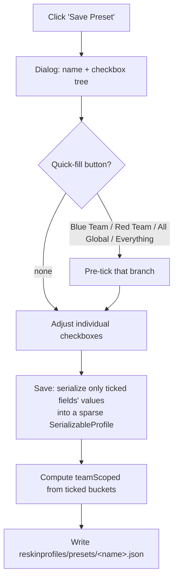
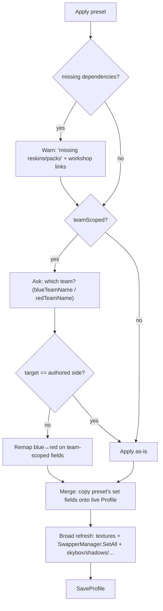

# Presets System — Design

Status (branch `presets`): **phases 1–5 implemented** (registry, model/codec/store, apply,
Presets UI, pack distribution) — compiles, not yet runtime-tested in-game. Remaining: phase 6
(`Load`/`Save` migration onto descriptors, gated by a round-trip test) and the deferred polish
(thumbnails, sidebar reorg). This document captures the agreed model.

## Goal

Let users save and re-apply sets of reskin settings — either the **whole** profile or
**partial** slices (one team's look, one section like Skybox, or an arbitrary hand-picked
subset). Pack creators can also **ship presets inside their reskin packs**, applied
read-only from the menu.

## Background — what we're building on

Today there is one flat profile (`ReskinProfileManager.Profile`, ~150 fields) saved as
`reskinprofiles/ReskinProfile.json`. The on-disk shape (`SerializableProfile`) is **already
all-nullable** with `?? default` fallback on load. Two important properties fall out of the
existing design and the whole preset system leans on them:

1. **A partial preset is just a `SerializableProfile` with only some fields set.** "Apply"
   = copy the non-null fields onto the live profile. The nullable-overlay model already
   exists; presets reuse it.
2. **Strong `blue*` / `red*` naming symmetry.** Almost every team-scoped setting exists as a
   parallel blue/red pair, which makes "apply this team's look to the other side" a
   mechanical field remap.

Two kinds of settings live side by side:

- **Reskin references** (`ReskinReference` = `PackId` + `EntryName` + `WorkshopId`) — sticks,
  jerseys, pads, helmets, masks, tape textures, ice, net, puck(s). Resolved against installed
  packs on load; if the pack is missing they resolve to `null` (preset still applies the rest).
- **Plain values** — colors, floats, bools, enums (tape modes, team names).

QoL config is deliberately **out of scope** — it lives in its own side-car files
(`QoLStorage`) so visual profiles stay shareable without leaking toggles/credentials. Presets
respect that boundary and never touch QoL.

## Core model

> A preset is **"the set of settings that were ticked when it was saved, plus their values."**

Everything else is built on that one sentence.

### The three preset *kinds* are emergent, not separate systems

Settings fall into three buckets by their team affinity:

| Bucket | Examples |
|--------|----------|
| **Blue team** | `blueSkaterTorso`, `blueTeamColor`, `blueGoalieHelmet`, blue tape, blue lettering/outline, blue minimap colors |
| **Red team** | exact mirror: `redSkaterTorso`, `redTeamColor`, … |
| **Global** | `skybox*`, `shadow*`, `puckFX*`, `gloss*`, arena/boards/glass, puck(s), ice, net, chat, minimap puck/scale/refresh |

The *kind* of a preset is simply which buckets it drew from:

| Kind | Contains | On apply, asks… |
|------|----------|-----------------|
| **Team preset** | one team's worth of look | "Apply to Blue or Red?" |
| **Global preset** | global settings only | nothing |
| **Full preset** | both teams + global | nothing (applies as-is) |

This is computed, not declared: if every team-scoped field in a preset is from one side, it's
a team preset and we offer the side choice on apply.

### Apply = merge / overlay

Applying a preset overwrites **only** the settings it contains; everything else is left
untouched. So a half-filled team preset (e.g. only the jersey, not the sticks) "just works" —
partialness needs no special handling, it's the default behavior.

### Team swap (apply-time, not save-time)

We store fields **as authored** (`blue*` / `red*`) plus a computed `teamScoped` marker. On
applying a one-sided (team) preset, the prompt is **"Which team do you want to apply this to?"**
with the two options labeled by the configured team names (`blueTeamName` / `redTeamName`,
falling back to "Blue" / "Red"). If the chosen target differs from the authored side, a
`blue ↔ red` remap runs silently — the user never sees "as-is vs other side," just picks a team.
The remap table is derived automatically from the field-name prefixes.

Rejected alternative: normalizing one-team presets to a "team-neutral" namespace on save. That
needs two storage formats (neutral for team presets, prefixed for full presets) and loses
"which side it came from." Apply-time swap keeps one format and is strictly more flexible (a
full preset can even be applied mirrored for free).

## Preset file format

A preset file = a small header + a **sparse `fields` map keyed by descriptor id** (the Profile
field name from the registry). Each value is encoded by the field's kind: primitives raw, colors
as `{r,g,b,a}`, reskin references as `{packId, entryName, reskinType, workshopId}`, ref lists as
an array of those. Only the saved fields appear, so the file is naturally sparse.

```jsonc
{
  "presetName": "Habs Home",
  "presetFormatVersion": 1,
  "teamScoped": "blue",          // null | "blue" | "red"  — computed; drives the "which team?" prompt
  "dependencies": [              // computed from the reskin refs used; for missing-pack warnings
    { "packId": "habs", "workshopId": 123456, "name": "Habs Reskins" }
  ],
  "fields": {
    "blueSkaterTorso": { "packId": "habs", "entryName": "home_torso", "reskinType": "jersey_torso", "workshopId": 123456 },
    "blueTeamColor":   { "r": 0.8, "g": 0.1, "b": 0.1, "a": 1 },
    "skyboxExposure":  1.3
  }
}
```

Keys are the registry's descriptor ids (`blueSkaterTorso`), **not** the legacy
`reskinprofile.json` keys (`blueSkaterTorsoRef`). Presets are a new format, so this avoids
maintaining a second `Profile ↔ SerializableProfile` mapping just for presets — the registry is
the single source. The legacy profile format is unchanged (see Backwards compatibility).

Same file shape everywhere — user presets, standalone shared files, and pack-bundled presets
are all this format. Storage locations differ only by folder (see Distribution).

## The field-descriptor approach ("describe each setting once")

**Problem it solves:** today, every setting is mentioned by hand in four places (`Profile`,
`SerializableProfile`, `Load`, `Save`) plus its section UI. Presets would otherwise need each
setting hand-listed *four more times* — checkbox tree, save-only-ticked, apply, blue↔red swap.

**Idea:** keep one master description of each setting (its name, its group, and whether it's
blue / red / global). Every preset feature loops over that one description instead of
re-listing settings. *(Analogy: one spreadsheet, every document generated from it.)*

**Why it's cheap here, not 150 hand-written rows:**

- Enumerate `Profile`'s public fields via **reflection** for generic get/set — the computer
  reads the field list, we don't type it.
- Derive `teamSide` and the blue↔red `swapPartner` **from the `blue`/`red` prefix** — the
  naming convention is consistent enough to auto-pair.
- The only thing supplied by hand is the **group label** per field (so the tree files it under
  "Skybox" vs "Sticks"), via a `[PresetField("group")]` attribute or one central
  section→fields map. Treat the group attribute as the **opt-in**: only annotated fields appear
  in presets, so nothing leaks accidentally. Add `[PresetIgnore]` / convention opt-outs for any
  field that doesn't fit (future `blueLine`-style false positives, non-presetable settings).

**Sequencing (the descriptors eventually drive `Load`/`Save` too — see Backwards compatibility):**

1. **Build descriptors for presets first, migrate `Load`/`Save` last.** This is ordering for
   blast-radius, not "never." The main load path has subtle behavior (default fallbacks, the
   puck-list migration) and works for everyone today, so we prove the descriptor approach on the
   new, low-risk preset path before pointing the critical path at it. The **end state is
   unified**: one description of each field driving presets *and* the main profile, killing the
   current four-places duplication.
2. **Broad-refresh apply for v1.** Rather than mapping each field to its specific swapper, after
   applying a preset run the same refresh the **Reload** button already does
   (`LoadTexturesForActiveReskins` → `SwapperManager.SetAll` → skybox/shadows/etc.). Heavier but
   robust and battle-tested. Per-group targeted refresh is a later optimization.

## Save flow (the checkbox tree)



Dialog sketch (tree is the source of truth; quick-fill buttons just pre-tick branches, then the
user fine-tunes — presets are **not** required to contain a whole bucket):

```
Save Preset:  [ name ___________ ]

Quick fill:  [Blue Team] [Red Team] [All Global] [Everything]

▾ ☐ Blue Team
   ▾ ◼ Jersey            ← tri-state parent (some children on)
       ☑ Torso
       ☑ Groin
       ☐ Lettering color
   ▾ ☐ Sticks
       ☐ Attacker (team)
       ☐ Goalie (team)
▾ ☐ Red Team
   …
▾ ☐ Global
   ▾ ☐ Skybox
   ▾ ☐ Puck FX
```

Tree grouping is **Team bucket → category → field** (independent of the sidebar's
category-first layout), because the mental model on apply is "put this on a team."

## Apply flow



Missing-dependency handling reuses today's behavior: a reskin reference whose pack isn't
installed resolves to `null` and is skipped (with the existing warning + workshop link), the
rest of the preset still applies. Cross-pack references are allowed — a preset's `dependencies`
list lets us surface exactly which packs are missing before applying.

## Distribution

| Source | Location | Writable? |
|--------|----------|-----------|
| User-saved | `reskinprofiles/presets/*.json` | yes (created by save dialog) |
| Standalone import/export | same folder, shared as plain files | yes |
| Pack-bundled | `<pack>/presets/*.json`, auto-discovered | **read-only** (apply only) |

Pack-bundled presets are **files in the pack's `presets/` folder**, auto-discovered on pack load
— *same format as user presets*, **no `reskinpack.json` involvement at all**. Presets are listed
**alphabetically by name**, so no manifest ordering is needed.

Pack-bundled presets are **apply-only**. To tweak one, the user applies it then edits their live
profile / saves a new personal preset.

### "Where do you want to save this?"

The save dialog offers a **destination**:

- **My Presets** → `reskinprofiles/presets/`
- **A local pack's presets** → `reskinpacks/<pack>/presets/` (the pack-authoring workflow; just
  writes the file). **Local packs only** — workshop packs are Steam-managed and any edit is
  clobbered on the next workshop update, so they aren't offered as targets (we still *read*
  presets from them fine).

## UI

**New `Presets` sidebar section** (the agreed home), placed right after `Packs`. Contains:

- **Reset all to defaults** — the "start fresh" action. None exists today (only per-section
  resets like `ResetSkyboxToDefault`); we add a global one that builds `new Profile()`, applies,
  and saves.
- **My presets list** — each row: name, source label, **Apply**, **Rename**, **Delete**, and
  (optional) preview thumbnail.
- **Pack presets list** — grouped/namespaced by source pack ("Pack: Foo"), apply-only, with a
  missing-dependency badge when reskins/packs are absent.
- **Import / Export** — bring in or share standalone preset files.
- **Save current as preset…** — opens the checkbox-tree dialog with the destination picker.

Preset-name collisions are handled by **namespacing the list by source** (My Presets vs.
"Pack: Foo"), so two "Home" presets never clash.

### Sidebar reorganization (its own UI phase)

The sidebar is currently a flat 16-button list:
`Packs, Appearance, Sticks, Tapes, Skaters, Goalies, Pucks, Puck FX, Arena, Skybox, Shadows,
User Interface, Quality of Life, Glossiness, Extras, About`.

Proposed nested layout (needs collapsible sidebar groups — today it's flat, so this is a
separate UI effort, not coupled to presets):

```
Packs
Presets
Reskins ▾            (Sticks, Tapes, Skaters, Goalies, Pucks)
Visuals ▾            (Puck FX, Skybox, Shadows, Glossiness)
Arena
Appearance
User Interface
Quality of Life
Extras
About
```

Also possible later: a **per-section "Save these as a preset"** button that opens the save dialog
pre-ticked to that section. Complements the global Presets section; not needed for v1.

### Thumbnails / preview images — DEFERRED (not in this project)

Reskins currently render as **text only**; there is no preview/thumbnail system, and building one
is significant scope. **Both** of these are explicitly out of scope for now and the system is
designed to not need them:

- **Per-row thumbnails in the save tree** — would lazy-load each reskin's texture via
  `TextureManager.GetTexture`. Deferred.
- **Preset preview image** — if ever added, it'd be a simple **author-supplied `<presetName>.png`
  sibling file** (no auto-capture). Deferred. The preset format has no preview field for now.

## Backwards compatibility (hard constraint)

**Existing `reskinprofile.json` files must keep loading unchanged.** The guarantee:

- `SerializableProfile` **is the JSON contract** — its `[JsonProperty]` names define the on-disk
  format. We do **not** change it.
- Descriptors only automate the *`Profile ↔ SerializableProfile` copying*. Same DTO → same JSON
  → identical files.
- When the `Load`/`Save` migration lands (final phase), gate it behind a **round-trip test**:
  load a representative existing profile, re-save via descriptors, assert the JSON is unchanged
  (modulo formatting). Only ship the migration once that passes.
- Preset files are a **new** format in a **new** folder (`reskinprofiles/presets/`), so they
  can't affect existing profile loading regardless.

## Build order

1. **Field descriptors + group metadata** — the master description (reflection + convention +
   group attribute). Preset-scoped only; `Load`/`Save` untouched.
2. **Preset model + sparse save/load helpers** — header + sparse `SerializableProfile`,
   `NullValueHandling.Ignore`; computed `teamScoped` + `dependencies`.
3. **Apply** — merge + broad refresh, "which team?" prompt + blue↔red swap, missing-dependency
   warning.
4. **Presets sidebar section** — reset-to-defaults, list / apply / rename / delete /
   import / export, save-tree dialog with destination picker.
5. **Pack-bundled presets** — auto-discover `<pack>/presets/*.json`, read-only, namespaced in UI.
6. **`Load`/`Save` migration onto descriptors** — gated by the round-trip test (see Backwards
   compatibility). Retires the four-places duplication.
7. **(Deferred, separate effort) Sidebar reorg** — nested Reskins/Visuals groups (needs
   collapsible groups).

## Resolved decisions

- **Save UX:** quick-fill **buttons that toggle the tree checkboxes** (guidance, not a cage).
- **Team apply prompt:** "Which team?" labeled by team names — not "apply to other side."
- **Cross-pack references:** allowed, with a `dependencies` list and a missing-reskins warning.
- **Name collisions:** reskin entries are already keyed `(packId, entryName, type)` via
  `ReskinReference` (collision-safe across packs today); preset-name clashes are handled by
  namespacing the list by source.
- **Tech debt:** `Load`/`Save` *do* get migrated onto descriptors (phase 6), sequenced last for
  safety, not skipped.
- **Reset to defaults:** new global action lives in the Presets section.
- **Pack presets:** folder-only (`<pack>/presets/*.json`), alphabetical, **no `reskinpack.json`
  involvement**.
- **Thumbnails / preview images:** deferred entirely; not part of this project.
```